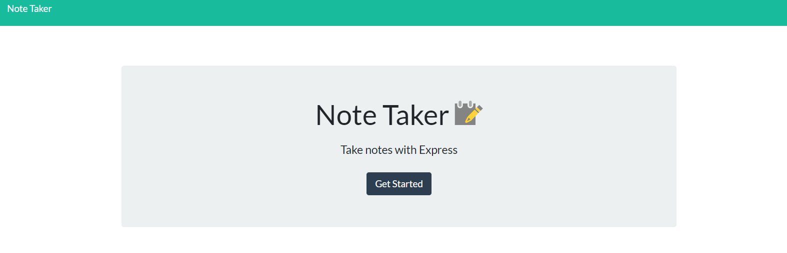
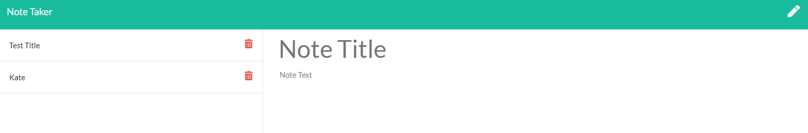

# Note Taker

  ## Description
   This application can be used to write, save, and delete notes. This application uses an express backend and save and retrieve note data from a JSON file.

  

  ## Table of Contents
  * [Installation](#installation)
  * [Usage](#usage)
  * [License](#license)
  * [Contributing](#contributing)
  * [Test](#tests)
  * [Questions](#questions) 

  ## User Story
  AS A user, I want to be able to write and save notes
  I WANT to be able to delete notes I've written before
  SO THAT I can organize my thoughts and keep track of tasks I need to complete

  ## Instructions
  This app should be deployed on Heroku. 

  ## License
  © 2020 Kate Meersman brand. All Rights Reserved.

  

  ## Contributing
  Kate Meersman

  ## Tests

  

  

  ## Questions
  * katie4682@yahoo.com
